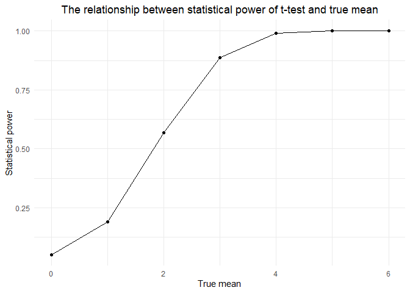

p8105_hw5_sg4489
================
sg4489

### Problem 2

First, I set up parameters and generate datasets.

``` r
# Set parameters
sample_size <- 30
sample_var <- 5
mu_values <- c(0, 1, 2, 3, 4, 5, 6)
alpha <- 0.05
n_sim <- 5000

# Function to simulate data and conduct t-test
simulate_t_test <- function(n, mu, sigma) {
  results <- replicate(n_sim, { 
    x <- rnorm(n, mean = mu, sd = sigma)  # Generate random data
    test <- t.test(x, mu = 0)  # Conduct t-test
    tidy_result <- tidy(test)  # Extract estimate and p-value
    list(estimate = tidy_result$estimate, p_value = tidy_result$p.value)
  }, simplify = FALSE)
  
  # Convert list to data frame
  data.frame(
    estimate = sapply(results, `[[`, "estimate"),
    p_value = sapply(results, `[[`, "p_value")
  )
}
```

Then, run simulations for each mu value.

``` r
# Run simulations for each value of mu and combine the results
simulation_results <- lapply(mu_values, function(mu) {
  simulate_t_test(sample_size, mu, sample_var)
})
names(simulation_results) <- mu_values
```

``` r
# Merge all results into one data frame 
simulation_data <- bind_rows(simulation_results, .id = "mu") %>%
  mutate(mu = as.numeric(mu))

# Calculate the statistical power for each mean value 
power_data <- simulation_data %>%
  group_by(mu) %>%
  summarize(power = mean(p_value < alpha))

# Draw a statistical power graph
ggplot(power_data, aes(x = mu, y = power)) +
  geom_line() +
  geom_point() +
  labs(title = "The relationship between statistical power of t-test and true mean",
       x = "True mean", y = "Statistical power") +
  theme_minimal() + 
  theme(plot.title = element_text(hjust = 0.5)) 
```

<!-- -->

``` r
# Calculate the average estimate for all samples
avg_estimate_data <- simulation_data %>%
  group_by(mu) %>%
  summarize(average_estimate = mean(estimate))

# Average estimate when only the null hypothesis is rejected
rejected_estimate_data <- simulation_data %>%
  filter(p_value < alpha) %>%
  group_by(mu) %>%
  summarize(average_estimate_rejected = mean(estimate))
```

The plot shows a positive relationship: as the effect size (true mean,
μ) increases, the statistical power also increases. This means the
t-test is more likely to detect a true effect with higher effect sizes,
making the test more reliable.  
At lower effect sizes (e.g. μ=0,1,2), the power is relatively low,
indicating a smaller probability of detecting a true effect.  
As μ increases to values like 4, 5, or 6, the power approaches 1,
meaning the test becomes almost certain to detect the true effect.

``` r
# Plot the average estimate
ggplot() +
  geom_line(data = avg_estimate_data, aes(x = mu, y = average_estimate), color = "blue", linetype = "dashed") +
  geom_point(data = avg_estimate_data, aes(x = mu, y = average_estimate), color = "blue") +
  geom_line(data = rejected_estimate_data, aes(x = mu, y = average_estimate_rejected), color = "red") +
  geom_point(data = rejected_estimate_data, aes(x = mu, y = average_estimate_rejected), color = "red") +
  labs(title = "Relationship between mean estimate and true mean",
       x = "True mean",
       y = "Average estimate",
       caption = "Blue: all samples, red: only samples that reject the null hypothesis") +
  theme_minimal() + 
  theme(plot.title = element_text(hjust = 0.5)) 
```

<!-- -->

The plot shows two sets of average estimates for different true means
(μ):

Blue Line (All Samples): This line represents the average estimate of μ
across all samples, regardless of whether the null hypothesis was
rejected.  
Red Line (Rejected Samples Only): This line represents the average
estimate of μ only for samples where the null hypothesis was rejected.

The red line is consistently above the blue line, especially for lower
values of μ. This indicates that the average estimate of μ for tests
where the null hypothesis is rejected tends to overestimate the true
mean.

The sample average of μ-hat across tests where the null is rejected is
not approximately equal to the true value of μ; it tends to be higher.
This is due to selection bias, where only samples showing strong effects
(i.e., larger estimates) lead to rejection of the null hypothesis.

### Problem 3

#### Part 1

Import data on homicides in 50 large U.S. cities.

``` r
homicides <- read_csv("data-homicides-master/homicide-data.csv", show_col_types = FALSE)
```

The raw data represents homicide cases across various large U.S. cities,
with each row corresponding to an individual homicide incident. Here’s a
description of the key columns:  
*reported_date*: Double - The date the homicide was reported, formatted
as an integer YYYYMMDD.  
*victim_last*: Character - The last name of the victim.  
*victim_first*: Character - The first name of the victim.  
*victim_race*: Character - The race of the victim (e.g., Hispanic,
White, Black, Other).  
*victim_age*: Character - The age of the victim, which might include
“Unknown” for some cases.  
*victim_sex*: Character - The sex of the victim (e.g., Male, Female).  
*city*: Character - The city where the homicide occurred.  
*state*: Character - The state abbreviation where the homicide
occurred.  
*disposition*: Character - The status of the homicide case, such as
“Closed without arrest,” “Open/No arrest,” or “Closed by arrest.”

``` r
# Create the city_state variable
homicides <- homicides %>% 
  mutate(city_state = paste(city, state, sep = ", ")) 

# Summarize the data: total and unsolved homicides
city_summary <- homicides %>% 
  group_by(city_state) %>% 
  summarize(
    total_homicides = n(), 
    unsolved_homicides = sum(disposition %in% c("Closed without arrest", "Open/No arrest"))
  )

city_summary
```

    ## # A tibble: 51 × 3
    ##    city_state      total_homicides unsolved_homicides
    ##    <chr>                     <int>              <int>
    ##  1 Albuquerque, NM             378                146
    ##  2 Atlanta, GA                 973                373
    ##  3 Baltimore, MD              2827               1825
    ##  4 Baton Rouge, LA             424                196
    ##  5 Birmingham, AL              800                347
    ##  6 Boston, MA                  614                310
    ##  7 Buffalo, NY                 521                319
    ##  8 Charlotte, NC               687                206
    ##  9 Chicago, IL                5535               4073
    ## 10 Cincinnati, OH              694                309
    ## # ℹ 41 more rows

#### Part 2

``` r
# Filter for Baltimore, MD
baltimore_data <- city_summary %>% filter(city_state == "Baltimore, MD")

# Run prop.test
baltimore_test <- prop.test(
  x = baltimore_data %>% pull(unsolved_homicides), 
  n = baltimore_data %>% pull(total_homicides)
)

# Apply the broom::tidy
baltimore_tidy <- broom::tidy(baltimore_test) 

# Extract the estimated proportion and confidence intervals
baltimore_proportion <- baltimore_tidy %>% select(estimate, conf.low, conf.high)
```

The estimated proportion of unsolved homicides in Baltimore, MD, is
0.6455607 . The 95% confidence interval for this estimate ranges from
0.6275625 to 0.6631599
